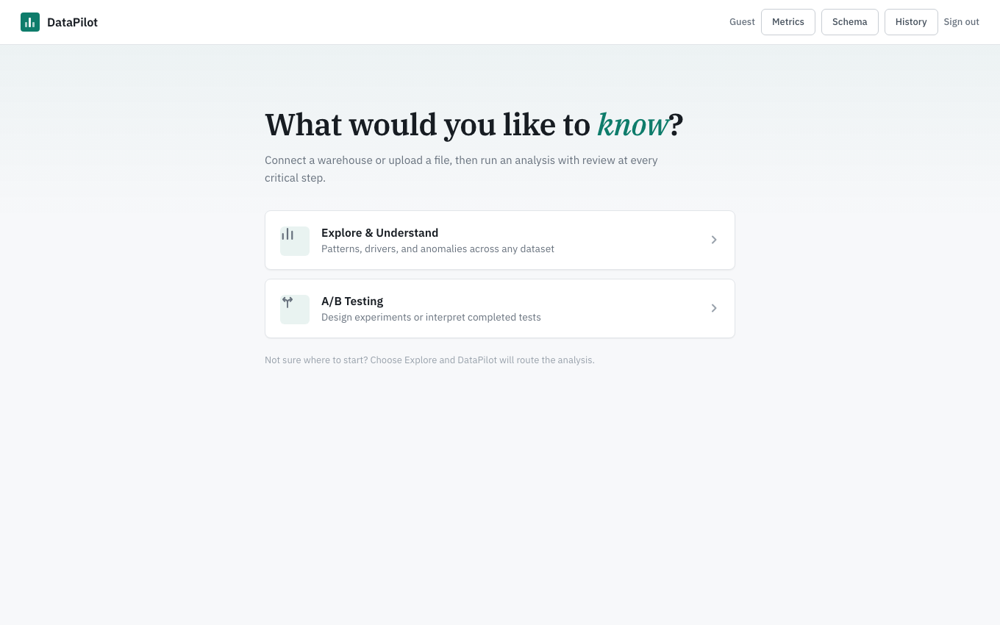
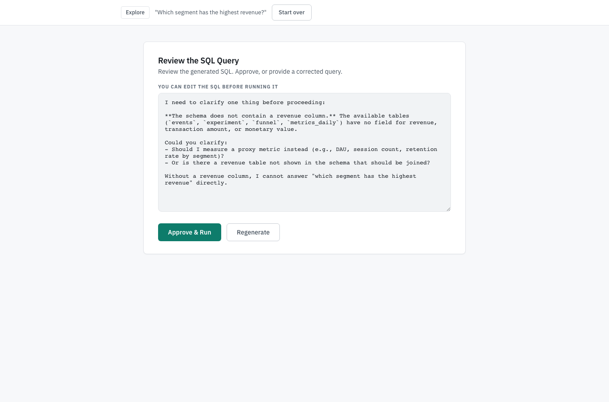
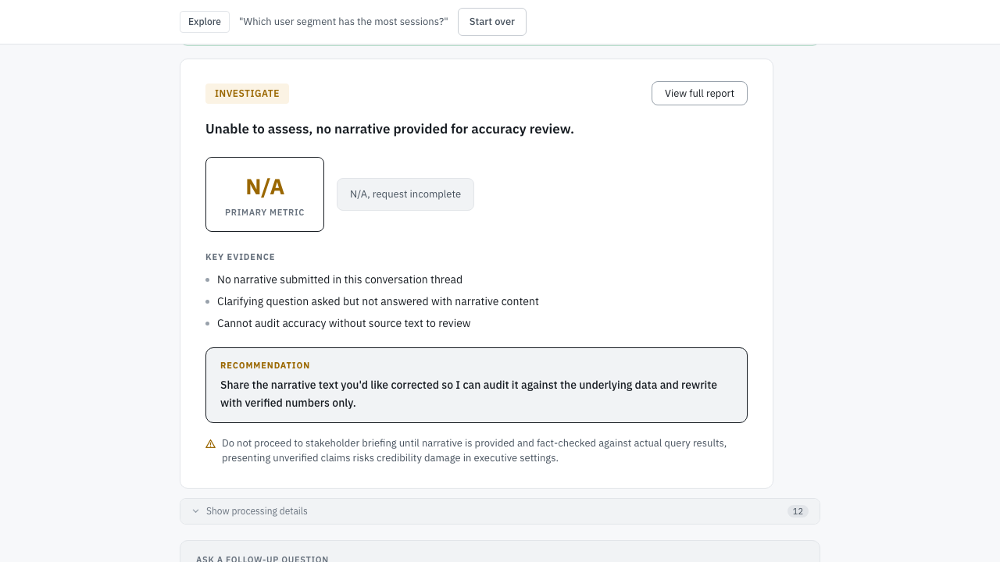
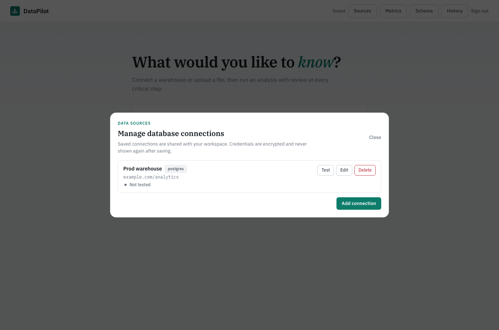

# DataPilot

**An AI data analyst that shows its work.** Ask a question in plain English; DataPilot writes the SQL, runs the statistics, and drafts a stakeholder-ready report. A human approves the SQL, the method, and the story before anything ships.

**Live demo:** [datapilotapp.singhaman.dev](https://datapilotapp.singhaman.dev) (guest login, no signup) · **API health:** [datapilot.singhaman.dev/health](https://datapilot.singhaman.dev/health)

**937 backend tests** · **30-test CSP suite against the production build** · **Playwright E2E** · **4 offline eval harnesses with a CI regression gate** · deployed on Railway



---

## The 60-second tour

1. **Ask.** "Did the new checkout flow increase revenue? Which segments benefited most?"
2. **Approve the SQL.** The generated query is shown, editable, and never runs without sign-off.
3. **Approve the analysis.** CUPED-adjusted t-test, subgroup effects, guardrail sweep, novelty check, and every intermediate result, reviewable and overridable.
4. **Approve the story.** The narrative is audited against the computed statistics before you see it; claims like "significant" or "ship it" are blocked when the numbers disagree.
5. **Deliver.** A stakeholder deck with a verdict, key evidence, and caveats. One click to PDF.

| Reviewing generated SQL | The finished report |
|---|---|
|  |  |

---

## Why this project is interesting engineering

This is not a chatbot wrapper. It is a production-shaped system with the failure modes of real analytics products designed out:

- **Human-in-the-loop as architecture, not UI.** The pipeline is a LangGraph state machine with four interrupt points. Runs pause at each gate, persist to checkpoints, and resume after approval, including across page reloads and server restarts.
- **The LLM never touches data directly.** It generates SQL; deterministic backend code validates it (SELECT-only, identifier quoting, content checks for empty results, arm imbalance, and JOIN fan-out), executes it, and computes every statistic with scipy/sklearn. Numbers in the report are traceable to tool output, and an automated audit rewrites or blocks claims that contradict them.
- **Evaluation is CI, not vibes.** Four deterministic harnesses (37 assertions across an experiment scenario, two cross-domain datasets, golden Q&A, and CSV fixtures) run on every push and fail the build if any score drops more than 2% below a committed baseline. Zero API cost, milliseconds to run.
- **Security posture is tested, not asserted.** An AST scan fails the build on any blocking call inside an async route (it found 56 sites a hand-grep missed). A log-safety test fails on any raw exception logged from the agent layer, because INFO logs become Sentry breadcrumbs and must never carry customer data. The CSP is tested against the production build with deliberate violations, so a policy that silently stopped enforcing would fail the suite.
- **Cost is governed.** Every LLM call goes through a metering wrapper with daily spend caps (global, per-user, and per-guest-IP, because guest identities are free to mint). Unknown models price at the most expensive known tier so spend can only trip early, never slip past.
- **Secrets are handled like secrets.** Warehouse credentials are encrypted at rest, never returned by the API, and wiped from workflow checkpoints after schema load. Private-network database hosts are blocked by default (SSRF guard).

The decision log with tradeoffs is in [decisions.md](decisions.md); the operational runbook is in [docs/production-operations.md](docs/production-operations.md).

---

## Pipeline

```
  User question (natural language)
        |
        v
  Semantic cache ---- similar past run? ----> cached result (zero API cost)
        |
        v
  Schema load + intent resolution ---> INTENT GATE (analyst confirms interpretation)
        |
        v
  SQL generation -----------------------> QUERY GATE (analyst reviews SQL before any data is touched)
        |
        v
  Execute query
        |
        +--- General analysis: describe, correlations, OLS regression,
        |    time series, anomaly detection, forecast
        |
        +--- Experiment analysis: metric decomposition, CUPED variance
        |    reduction, t-test, subgroup (HTE) analysis, novelty check,
        |    MDE and post-hoc power, guardrail sweep, funnel analysis
        |
        v
  ANALYSIS GATE (analyst reviews findings, can override any result)
        |
        v
  Narrative generation + automated claim audit
        |
        v
  NARRATIVE GATE (analyst approves or requests revision)
        |
        v
  Stakeholder deck + full report + PDF, logged with a quality score
```

Nothing moves past a gate without approval. Each gate takes seconds; skipping them is how wrong SQL and hallucinated statistics reach production.

---

## Data sources

Upload a CSV or Excel file, or connect a warehouse. Connections are first-class objects with health tracking:



- **Backends:** DuckDB (uploads and demo data), PostgreSQL (all schemas, not just `public`), MySQL, BigQuery
- **Managed lifecycle:** save with a live test, re-test anytime, edit and rotate credentials (health resets on rotation so a stale green badge cannot lie), delete
- **SSL mode selection** for Postgres/MySQL; service-account JSON for BigQuery
- **Schema annotations:** column comments and business synonyms injected into the schema context so SQL matches how the team talks about the data
- **Metric packs:** versioned metric definitions; certified packs skip the confirmation gate and constrain SQL to the agreed definitions
- **Workspaces:** owner/analyst roles, shared connections, packs, and run history; mutations are owner-only

---

## Quality and trust

Six layers stand between a wrong answer and a stakeholder:

| Layer | What it catches |
|-------|----------------|
| Offline eval harnesses | Wrong tool outputs, missing golden answers, regressions vs the committed baseline |
| SQL content validation | Empty results, missing experiment arms, arm imbalance, JOIN fan-out, percentage/rate confusion |
| Claim-accuracy audit | "Significant" when the CI crosses zero, "large effect" with a small Cohen's d, direction contradicting the data. Auto-corrected before the analyst sees it |
| Safety constraints | Blocks "ship" language under sample-ratio mismatch, breached guardrails, or winner's-curse conditions |
| Trust indicators | Every report carries a confidence level with the reason, derived from data volume and method |
| Audit log | Every approved report records the run ID, gate decisions, acknowledgments, and auto-correction count |

Current eval scores (run `make eval` locally, no API key needed):

| Harness | Score | Validates |
|---------|-------|-----------|
| DAU experiment | 12/13 | HTE segment, CUPED, t-test, guardrails, decomposition, forecast |
| Cross-domain | 13/13 | Clinical trial and ecommerce A/B on real sample data |
| Transactions Q&A | 7/7 | Golden answers plus faithfulness on a 10k-row dataset |
| CSV fixtures | 4/4 | Keyword and faithfulness checks across four domains |

---

## Stack

| Layer | Technology |
|-------|-----------|
| Frontend | React 18, TypeScript, Vite; IBM Plex design system; Recharts |
| Backend | FastAPI, uvicorn |
| Agent orchestration | LangGraph with interrupt/resume and SQLite checkpointing |
| LLM | Anthropic Claude, metered and spend-capped |
| Query engines | DuckDB, PostgreSQL, MySQL, BigQuery |
| Statistics | scipy, numpy, scikit-learn, Prophet |
| Semantic cache | MiniLM embeddings, three-tier similarity thresholds |
| Auth | JWT (HS256), PBKDF2, HttpOnly cookies, refresh rotation |
| Observability | Sentry with log redaction, structured logging |
| CI | pytest (937), offline eval gate, Playwright E2E, CSP suite, gitleaks |

---

## Architecture decisions, briefly

- **LangGraph over a plain chain** because the pipeline needs conditional branching and mid-graph interrupt/resume with persistence. A chain cannot pause for a human and pick up where it left off.
- **Approval gates over full autonomy** because autonomous agents fail silently. The gates make the failure mode "analyst clicks reject" instead of "wrong number in an exec deck."
- **DuckDB for execution** because columnar engines are built for aggregation and it gives one SQL interface across uploads, demo data, and external warehouses.
- **Deterministic evals over LLM-as-judge** because judges cost money, add variance, and create circular dependencies. Faithfulness checking (are the narrative's numbers actually in the data?) catches the worst failure mode for free.
- **SSE over WebSockets** because a run is a one-way event stream with occasional POSTs back; SSE reconnects automatically and needs no proxy configuration.
- **Semantic cache with local embeddings** because analyst questions repeat in meaning but not in wording, and a cache hit costs zero tokens and zero seconds.

Longer versions with the tradeoffs considered: [decisions.md](decisions.md).

---

## Run it locally

```bash
git clone https://github.com/Aman12x/DataPilot && cd DataPilot
python -m venv venv && source venv/bin/activate
pip install -r backend/requirements.txt

cp .env.example .env          # add ANTHROPIC_API_KEY
python data/generate_data.py  # demo dataset

cd backend && uvicorn api.main:app --reload --port 8000
# new terminal:
cd frontend && npm install && npm run dev   # http://localhost:5173
```

Tests and evals:

```bash
./venv/bin/python -m pytest tests/ -m "not integration and not slow" -q   # 937 tests, ~30s
make eval                                                                 # offline eval harnesses
cd frontend && npx playwright test                                        # E2E against a local stack
```

Deployment notes (Railway, volumes, environment) are in [docs/production-operations.md](docs/production-operations.md).

---

## Documentation map

| Doc | For |
|---|---|
| [CLAUDE.md](CLAUDE.md) | Working in the codebase: layout, invariants, traps, open issues |
| [decisions.md](decisions.md) | Architecture decision log |
| [docs/production-operations.md](docs/production-operations.md) | Config, spend caps, retention, CSP, runbook |
| [evals/README.md](evals/README.md) | Eval harness architecture and how to add one |

---

Built by [Aman Singh](https://github.com/Aman12x).
